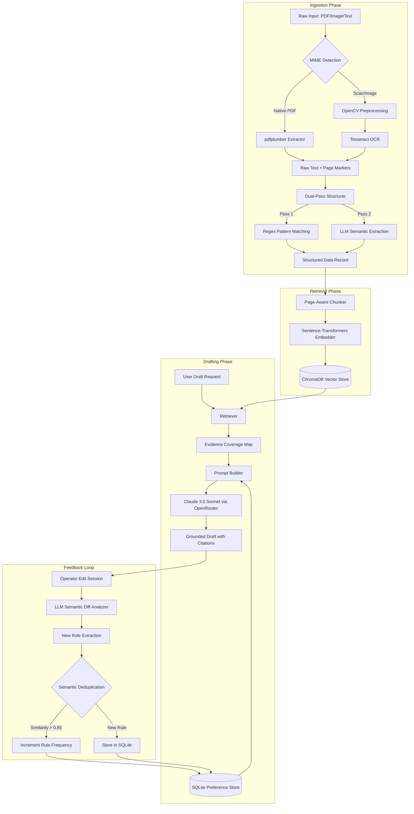

# LexDraft — Architecture Documentation

LexDraft is a high-precision legal document processing system designed for grounded drafting and iterative improvement. It bridges the gap between messy raw inputs (scanned images, noisy PDFs) and professional, citation-backed legal drafts.

## System Overview

---

## Component Deep-Dive

### 1. Document Ingestion
**Core Logic:** `ingestion/loader.py`, `ingestion/ocr.py`, `ingestion/structurer.py`

*   **Adaptive Extraction:** The system distinguishes between native PDFs (text-based) and scanned documents. Scanned images undergo a multi-stage **OpenCV** conditioning pipeline (Grayscale → Binarization → Denoising → Deskewing) before Tesseract OCR is applied.
*   **Dual-Pass Structuring:** To maximize reliability, we first use high-speed **Regex** to find strict patterns (Case Numbers, Dates). We then use **Claude 3.5 Sonnet** to semantically verify these fields and extract more complex relationships (Parties & Roles, Obligations).

### 2. Grounded Retrieval Layer
**Core Logic:** `retrieval/retriever.py`, `retrieval/vector_store.py`

*   **Page-Awareness:** Chunks are strictly forbidden from crossing page boundaries. This ensures that every citation (`[1]`, `[2]`) in the final draft can be traced back to a specific, unambiguous page number in the source material.
*   **Vector Engine:** Uses `all-MiniLM-L6-v2` embeddings stored in **ChromaDB**. We maintain both a global index (for cross-matter search) and per-document indices (for targeted drafting).

### 3. drafting & The Preference Engine
**Core Logic:** `drafting/generator.py`, `feedback/preference_store.py`

*   **Grounded Prompting:** The prompt builder assembles a "Context Block" containing extracted metadata and ranked evidence snippets. The LLM is instructed via a strict system persona to *only* generate text supported by the provided snippets.
*   **Semantic Feedback Learning:** This is the system's differentiator. Instead of simple text diffs, we use an LLM to analyze *why* an operator edited a draft. 
    *   **Deduplication:** When a new preference is learned (e.g., "Always use 'Respondent' instead of 'Defendant'"), it is embedded and compared against existing rules. If the cosine similarity is > 0.85, the rules are merged and the "frequency" (confidence) of that rule increases.

---

## Persistence Layer

| Store | Technology | Purpose |
| :--- | :--- | :--- |
| **Vector Store** | ChromaDB | High-speed semantic search & passage retrieval |
| **Relational DB** | SQLite | Metadata, Edit Session history, and Learned Preference rules |
| **File Cache** | Local FS | Persistent storage for processed PDF/Image binaries |

## Key Design Tradeoffs

1.  **OpenRouter vs. Direct SDK:** We chose OpenRouter to provide immediate access to the latest models (Claude 3.5 Sonnet) while maintaining an OpenAI-compatible interface, making the system highly portable.
2.  **Local Embedding vs. Cloud API:** We used a local `all-MiniLM-L6-v2` model. This eliminates latency/cost for embedding generation and ensures data privacy for the retrieval layer.
3.  **Monolithic vs. Microservice:** While the codebase is modular, we provide a unified API via FastAPI. For the Streamlit Cloud deployment, we implemented a background process manager that boots the API inside the frontend container, simplifying the reviewer's setup experience.
