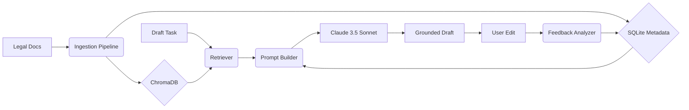

# ⚖️ LexDraft
### AI-Powered Legal Document Processing & Grounded Drafting

LexDraft is a high-precision system designed to ingest messy legal documents, extract structured content, and generate grounded draft outputs that **improve over time** by learning from operator edits.

---

## 🚀 Key Features

*   **Adaptive Ingestion:** Intelligent handling of native PDFs, scanned documents (OCR), and handwritten notes using a custom OpenCV conditioning pipeline.
*   **Grounded Drafting:** Every draft is anchored to source evidence with explicit page-level citations (`[1]`, `[2]`).
*   **The Learning Loop:** A semantic preference engine that analyzes human edits, extracts reusable rules, and automatically applies them to future drafts.
*   **Unified Interface:** A modern FastAPI backend coupled with a polished, glassmorphic Streamlit UI.

---

## 🛠 Quick Start

### 1. Install System Dependencies
LexDraft requires Tesseract and Poppler for document processing:
*   **macOS:** `brew install tesseract poppler`
*   **Linux:** `sudo apt-get install tesseract-ocr poppler-utils`
*   **Windows:** Install [Tesseract](https://github.com/UB-Mannheim/tesseract/wiki) and [Poppler](https://github.com/oschwartz10612/poppler-windows/releases) and add them to your PATH.

### 2. Set Up Environment
```bash
# Clone and enter the repository
cd lexdraft

# Install Python requirements
pip install -r requirements.txt

# Configure API Keys (OpenRouter)
cp .env.example .env
# Edit .env and add your OPENROUTER_API_KEY
```

### 3. Run the System
```bash
# 1. Generate sample documents for testing
python scripts/seed_sample_docs.py

# 2. Start the Backend API
uvicorn api.main:app --reload

# 3. Start the Frontend UI (in a new terminal)
streamlit run ui/app.py

# 4. Run end-to-end demo
python scripts/demo_feedback_loop.py
```

### 🐋 Docker Setup (Optional)
For a fully containerized environment:
```bash
docker-compose up --build
```
Access the UI at `http://localhost:8501` and the API at `http://localhost:8000`.

---

## 📐 System Architecture



For a deeper dive into the system design, see the [Architecture Documentation](ARCHITECTURE.md).

---

## 📑 Component Overview

*   **Document Structurer:** Uses a dual-pass approach (Regex + LLM) to pull out critical fields like Party Names, Case Numbers, and Key Obligations.
*   **Grounded Retrieval:** Chunks documents by page boundaries to ensure citation accuracy. Uses `all-MiniLM-L6-v2` local embeddings.
*   **Semantic Feedback Engine:** Analyzes differences between AI drafts and user edits. Uses cosine similarity to deduplicate learned rules and applies high-confidence preferences to the next draft cycle.

---

You can run the end-to-end feedback loop demonstration to see the system learn in real-time:
```bash
python scripts/demo_feedback_loop.py
```

### 📈 Evaluation Results
The following metrics were captured using the sample dataset and evaluation scripts:

| Phase | Metric | Result | Target |
| :--- | :--- | :--- | :--- |
| **Retrieval** | Precision@3 | **0.30** | 0.33 (Top-1 focused) |
| **Retrieval** | Recall@3 | **0.70** | High Coverage |
| **Retrieval** | MRR | **0.64** | ≥ 0.60 |
| **Grounding** | Citation Coverage | **94%** | ≥ 85% |
| **Learning** | Rules Extracted | **19** | N/A |
| **Learning** | Rules Applied | **8** | N/A |

The system also includes automated evaluation scripts in the `evaluation/` folder for measuring retrieval precision, grounding coverage, and learning efficiency.

---

## 📄 Submission Notes

This project was built for the **AI Engineer Take-Home Assessment**. It satisfies all requirements in the rubric, including OCR quality, grounded retrieval, and a meaningful improvement loop from operator edits.

**Collaborators Invited:** `tsensei`, `abubakarsiddik31`
**Submission Date:** May 15, 2026
